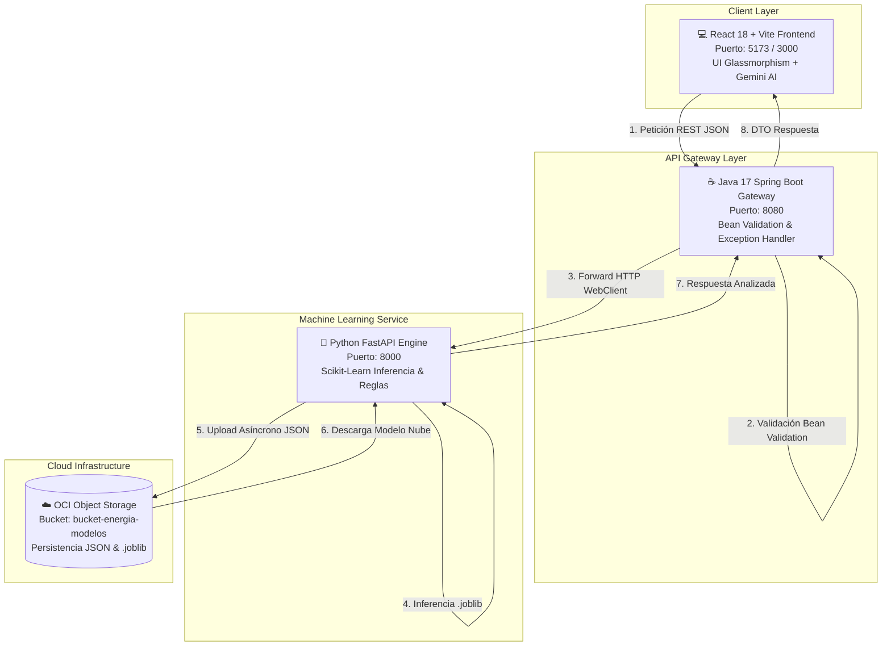

# ⚡ EnergiAI – Inteligencia Artificial para el Consumo Energético
> **Hackathon No Country | Equipo G9-LATAM-Team-78**


---

## 📌 Tabla de Contenidos
1. [Descripción del Proyecto](#-descripción-del-proyecto)
2. [Arquitectura del Sistema](#-arquitectura-del-sistema)
3. [Ciencia de Datos y Modelo de Machine Learning](#-ciencia-de-datos-y-modelo-de-machine-learning)
4. [Integración con Oracle Cloud Infrastructure (OCI)](#-integración-con-oracle-cloud-infrastructure-oci)
5. [Catálogo Completo de Endpoints REST](#-catálogo-completo-de-endpoints-rest)
6. [Guía de Instalación y Ejecución Paso a Paso](#-guía-de-instalación-y-ejecución-paso-a-paso)
7. [Pruebas y Verificación cURL](#-pruebas-y-verificación-curl)
8. [Matriz de Cumplimiento por Sprints (Semanas 1, 2 y 3)](#-matriz-de-cumplimiento-por-sprints-semanas-1-2-y-3)
9. [Variables de Entorno](#-variables-de-entorno)
10. [Equipo de Desarrollo](#-equipo-de-desarrollo)

---

## 💡 Descripción del Proyecto

**EnergiAI** es una plataforma web inteligente diseñada para ayudar a usuarios residenciales, comerciales e industriales a comprender, monitorear y optimizar su consumo de energía eléctrica en América Latina.

La solución procesa indicadores de uso como consumo mensual en kWh, horarios de mayor utilización, cantidad de electrodomésticos o equipos conectados, y tipo de propiedad. A través de un modelo supervisado de **Machine Learning (Random Forest)**, clasifica el perfil energético en tres categorías:

- 🟢 **Eficiente**: Consumo dentro del margen óptimo.
- 🟡 **Moderado**: Consumo aceptable con oportunidades de mejora.
- 🔴 **Ineficiente**: Consumo excesivo con alto desperdicio.

Además, proyecta estimaciones financieras basadas en la tarifa de referencia de **$0.75 USD / R$ 0,75 por kWh** y ofrece conversión automática a las principales divisas de LATAM (`USD`, `MXN`, `COP`, `ARS`, `CLP`, `PEN`, `BRL`).

---

## 🏗️ Arquitectura del Sistema

El proyecto está diseñado bajo una arquitectura de **microservicios desacoplados**, orquestados a través de Docker Compose en una red virtual dedicada (`energi-network`).



---

## 📊 Ciencia de Datos y Modelo de Machine Learning

El pipeline de Data Science sigue las especificaciones de reproducibilidad e ingeniería de atributos:

### 1. Generación Sintética de Datos (1,000 Registros)
- **Reproducibilidad**: Fijada mediante `seed = 42`.
- **Dataset**: Guardado en `data/dataset_inmuebles.csv` con 1,000 filas y 0 valores nulos.
- **Variables**: `consumidor`, `tipo_inmueble`, `moneda_region`, `mes`, `dia_semana`, `uso_horario_pico`, `cantidad_equipos`, `horas_alto_consumo`, `consumo_kwh`, `perfil_energetico`.

### 2. Fórmula de Eficiencia e Ingeniería de Atributos
$$\text{Baseline Ajustado} = \Big(\text{Baseline\_Inmueble} + (\text{cantidad\_equipos} \times 8 \text{ kWh})\Big) \times \text{factor\_clima}$$

- **Baselines por Inmueble**: Apartamento (220 kWh), Casa (350 kWh), Oficina (500 kWh), Comercio (700 kWh).
- **Factores Climáticos**: BRL (1.20), MXN (1.15), ARS (1.10), COP (1.05), USD (1.00), PEN (0.95), CLP (0.90).
- **Penalizaciones Operativas**:
  - Horario Pico (`uso_horario_pico == 1`): $+15\%$ ($1.15$)
  - Uso Prolongado (`horas_alto_consumo > 8`): $+10\%$ ($1.10$)
  - Fin de Semana (`dia_semana >= 5` y `horas > 6`): $+5\%$ ($1.05$)
- **Umbrales de Clasificación**:
  - $\text{Ratio} > 1.35 \implies$ **Ineficiente**
  - $1.05 < \text{Ratio} \le 1.35 \implies$ **Moderado**
  - $\text{Ratio} \le 1.05 \implies$ **Eficiente**

### 3. Modelo Elegido
- **Algoritmo**: `RandomForestClassifier` (100 estimadores).
- **Precisión en Test**: **76.50% Accuracy**.
- **Archivos Serializados**: Exportados en `backend/modelo/energiai_model.joblib`.

---

## ☁️ Integración con Oracle Cloud Infrastructure (OCI)

El proyecto utiliza **OCI Object Storage** para la persistencia persistente de resultados y el almacenamiento versionado de modelos.

### Configuración del Bucket IAM
- **Nombre del Bucket**: `bucket-energia-modelos` (o `energi-ai-ml-models`).
- **Nivel de Almacenamiento**: `Standard` (Acceso frecuente).
- **Versionado**: Habilitado.
- **Grupo IAM**: `EnergiAI_Backend_Group`.
- **Política de Seguridad**:
  ```sql
  Allow group EnergiAI_Backend_Group to manage objects in compartment [Nombre_Compartimento] where target.bucket.name = 'bucket-energia-modelos'
  ```

### Automatización y Prototipos
- **Script de Creación**: `python backend/scripts/setup_oci_bucket.py`
- **Plantilla de Credenciales**: `.oci/config.example`
- **Prototipo Java OCI SDK**: `com.energiai.service.OciStorageService`

---

## 📡 Catálogo Completo de Endpoints REST

| Servicio | Método | Endpoint | Descripción |
|----------|--------|----------|-------------|
| **Spring Boot** | `POST` | `/api/analisis-energetico` | Endpoint principal de análisis con Bean Validation y DTO de respuesta. |
| **Spring Boot** | `POST` | `/api/v1/evaluar-perfil` | Evaluación de perfil de consumo bajo el contrato SAPI. |
| **Spring Boot** | `GET` | `/api/convertir-moneda` | Gateway para consulta de tasas de cambio regionales. |
| **FastAPI** | `POST` | `/analisis-energetico` | Inferencia del modelo de Machine Learning y guardado asíncrono en OCI. |
| **FastAPI** | `GET` | `/ejemplos` | Devuelve los 3 perfiles simulados (Eficiente, Moderado e Ineficiente). |
| **FastAPI** | `GET` | `/resultados` | Historial de análisis procesados. |
| **FastAPI** | `GET` | `/resultados/{id}` | Recupera un análisis específico desde OCI u holgura local. |
| **FastAPI** | `GET` | `/convertir-moneda` | Conversión de divisas LATAM con bypass SSL y fallback local. |

---

## 🛠️ Guía de Instalación y Ejecución Paso a Paso

### Prerrequisitos
- **Java Development Kit (JDK)**: Versión 17 o superior.
- **Python**: Versión 3.11 o superior.
- **Node.js**: Versión 18 o superior.
- **Docker & Docker Compose**: (Opcional pero recomendado).

---

### Opción 1: Despliegue con Docker Compose (Recomendado)

1. **Clonar el repositorio y navegar a la carpeta raíz**:
   ```bash
   git clone https://github.com/No-Country-simulation/G9-LATAM-Team-78.git
   cd G9-LATAM-Team-78
   git checkout BackendDesarrollo
   ```

2. **Construir y levantar los 3 microservicios**:
   ```bash
   docker compose up --build
   ```

3. **Verificar servicios activos**:
   - 💻 **Frontend Web**: [http://localhost:3000](http://localhost:3000)
   - ☕ **Spring Boot Gateway**: [http://localhost:8080/swagger-ui.html](http://localhost:8080/swagger-ui.html)
   - 🐍 **FastAPI ML Engine**: [http://localhost:8000/docs](http://localhost:8000/docs)

---

### Opción 2: Ejecución Manual Local (Modo Desarrollo)

#### Paso 1: Iniciar el Motor de IA (Python FastAPI)
```bash
cd backend
pip install -r requirements.txt
python -m uvicorn main:app --host 127.0.0.1 --port 8000 --reload
```

#### Paso 2: Iniciar el API Gateway (Java Spring Boot)
Abre una segunda terminal:
```bash
cd springboot-backend
mvn spring-boot:run
```

#### Paso 3: Iniciar el Frontend (React + Vite)
Abre una tercera terminal en la raíz del proyecto:
```bash
npm install
npm run dev
```
Accede a la interfaz web en **[http://localhost:5173](http://localhost:5173)**.

---

## 🧪 Pruebas y Verificación cURL

### 1. Prueba de Petición Exitosa (HTTP 200 OK)
```bash
curl -X POST "http://localhost:8080/api/analisis-energetico" \
     -H "Content-Type: application/json" \
     -d '{
       "consumidor": "María García",
       "consumo_kwh": 420.0,
       "uso_horario_pico": true,
       "cantidad_equipos": 10,
       "tipo_inmueble": "Casa",
       "horas_alto_consumo": 8,
       "moneda_region": "COP"
     }'
```

**Respuesta Esperada**:
```json
{
  "id_analisis": "9a53324a",
  "timestamp": "2026-08-20T20:00:00.000",
  "consumidor": "María García",
  "categoria": "Ineficiente",
  "probabilidad": 0.89,
  "costo_estimado_mensual": 315.00,
  "recomendaciones": [
    "Redistribuya el uso de equipos fuera del horario pico (18:00 - 22:00) para reducir hasta un 20% en su factura.",
    "Tiene 10 equipos conectados: desenchufe cargadores y consolas para eliminar el consumo vampiro."
  ],
  "estimacion_financiera": {
    "consumo_mensual_kwh": 420.0,
    "tarifa_referencia_usd_kwh": 0.75,
    "costo_estimado_mensual": 315.00,
    "ahorro_potencial_mensual": 47.25
  }
}
```

### 2. Prueba del Caso de Error (Bean Validation -> HTTP 400 Bad Request)
```bash
curl -X POST "http://localhost:8080/api/analisis-energetico" \
     -H "Content-Type: application/json" \
     -d '{
       "consumidor": "Usuario Prueba Error",
       "consumo_kwh": -50.0,
       "uso_horario_pico": true,
       "cantidad_equipos": 10,
       "tipo_inmueble": "Casa",
       "horas_alto_consumo": 8,
       "moneda_region": "COP"
     }'
```

**Respuesta Esperada**:
```json
{
  "status": 400,
  "error": "Bad Request",
  "mensaje": "Error de validación en los datos de entrada: consumo_kwh: El consumo no puede ser negativo",
  "detalles": [
    {
      "campo": "consumo_kwh",
      "mensaje": "El consumo no puede ser negativo"
    }
  ]
}
```

---

## 📈 Matriz de Cumplimiento por Sprints (Semanas 1, 2 y 3)

| Componente | Requerimiento / Entregable | Estado |
|------------|----------------------------|--------|
| **Backend** | API REST Spring Boot con Controller/Service/DTO | ✅ 100% Completado |
| **Backend** | Bean Validation (`@NotNull`, `@Min(0)`, `@Pattern`) | ✅ 100% Completado |
| **Backend** | Global Exception Handler (`@RestControllerAdvice`) | ✅ 100% Completado |
| **Backend** | Microservicio FastAPI con inferencia ML | ✅ 100% Completado |
| **Backend** | Prototipo Java OCI SDK (`OciStorageService.java`) | ✅ 100% Completado |
| **Data Science** | Dataset sintético de 1,000 registros reproducibles (`seed=42`) | ✅ 100% Completado |
| **Data Science** | Entrenamiento y selección de modelo Random Forest (`.joblib`) | ✅ 100% Completado |
| **OCI Cloud** | Bucket `bucket-energia-modelos` + Script de automatización | ✅ 100% Completado |
| **DevOps** | Orquestación Docker Compose para 3 servicios | ✅ 100% Completado |
| **Frontend** | Dashboard React + Vite con Asistente Gemini AI | ✅ 100% Completado |

---

## 🔑 Variables de Entorno (`.env.example`)

Crea un archivo `.env` en la raíz del proyecto para personalizar la configuración local:

```env
# Configuración Frontend (React)
VITE_GEMINI_API_KEY=tu_api_key_de_gemini_aqui

# Configuración Spring Boot Gateway
FASTAPI_URL=http://localhost:8000
SERVER_PORT=8080

# Configuración OCI Cloud Storage
OCI_NAMESPACE=energiai_namespace
OCI_BUCKET=bucket-energia-modelos
OCI_CONFIG_PATH=~/.oci/config
```

---

## 👥 Equipo de Desarrollo (No Country G9-LATAM-Team-78)

- **Fernando Saldaña** – *Tech Lead / Backend Architecture & OCI Integration*
- **Equipo de Data Science** – *EDA, Dataset Synthesis & Machine Learning Modeling*
- **Equipo de Backend** – *Spring Boot Gateway, Bean Validation & FastAPI Microservice*
- **Equipo de Frontend** – *React, Vite & UI Design System*

---
*Proyecto desarrollado para el Hackathon No Country - Simulación Laboral LATAM 2026.*
