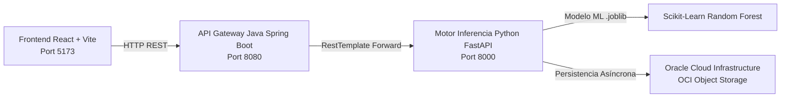

# ⚡ EnergiAI – Inteligencia para el Consumo Energético
> **Hackathon No Country | Equipo G9-LATAM-Team-78**

**EnergiAI** es una plataforma web inteligente de eficiencia energética que analiza patrones de consumo eléctrico residencial y comercial, clasifica el perfil de uso (*Eficiente*, *Moderado*, *Ineficiente*), detecta desperdicios y proyecta estimaciones financieras con la tarifa de referencia de **R$ 0,75 / $0.75 por kWh**.

---

## 🏗️ Arquitectura de la Solución (Microservicios + OCI)



1. **Frontend (React 18 + Vite + Tailwind/Glassmorphism)**:
   - Dashboard interactivo responsivo con gráficos de consumo horario y semanal.
   - Asistente IA EnergiAI con Gemini Flash y fallback inteligente.

2. **API Gateway / BFF (Java 17 + Spring Boot 3.2)**:
   - Bean Validation (`@NotNull`, `@Min(0)`, `@Pattern` para `moneda_region`).
   - Manejo global de excepciones (`@RestControllerAdvice` en `GlobalExceptionHandler.java`).
   - Documentación interactiva Swagger UI / OpenAPI 3.0.

3. **Motor Inferencia de IA (Python 3.11/3.14 + FastAPI)**:
   - Inferencia con modelo Random Forest serializado (`energiai_model.joblib`).
   - Integración asíncrona no bloqueante con **OCI Object Storage** SDK.
   - Algoritmo determinista de clasificación y recomendaciones de alto impacto.

---

## 🎯 Entregables del Sprint 1 y Sprint 2 (Backend)

### 🔹 Sprint 1
- Estrategia de validación (Bean Validation) y manejo de errores.
- Creación del esqueleto Spring Boot e integración con el microservicio de IA en FastAPI.
- Definición de los contratos REST principales (`POST /analisis-energetico` y `POST /api/v1/evaluar-perfil`).

### 🔹 Sprint 2
- **Tratamiento del campo `moneda_region`**: Incorporado en `AnalisisRequestDTO` y validado con patrones para monedas LATAM (`USD`, `MXN`, `COP`, `ARS`, `CLP`, `PEN`, `BRL`).
- **Integración OCI Object Storage**: Persistencia en segundo plano de resultados JSON en el bucket `energiai-bucket` usando el SDK de OCI (`oci.object_storage`).
- **Manejo Global de Excepciones**: Respuestas HTTP 400 Bad Request estructuradas cuando `consumo_kwh` sea negativo o la validación falle.
- **Bypass SSL y Fallback Moneda**: Resolución de error CA SSL e incorporación de tasas de respaldo para convertir divisas LATAM.

---

## 📡 Catálogo de Endpoints REST

| Servicio | Método | Endpoint | Descripción |
|----------|--------|----------|-------------|
| **Spring Boot** | `POST` | `/api/analisis-energetico` | Endpoint principal de análisis con Bean Validation y DTO response. |
| **Spring Boot** | `POST` | `/api/v1/evaluar-perfil` | Evaluación de perfil según contrato SAPI. |
| **Spring Boot** | `GET` | `/api/convertir-moneda` | Consulta de tasas de cambio regionales. |
| **FastAPI** | `POST` | `/analisis-energetico` | Inferencia del modelo de Machine Learning y persistencia en OCI. |
| **FastAPI** | `GET` | `/ejemplos` | Devuelve los 3 perfiles simulados (Eficiente, Moderado, Ineficiente). |
| **FastAPI** | `GET` | `/resultados` | Historial de análisis procesados. |
| **FastAPI** | `GET` | `/convertir-moneda` | Conversión de divisas LATAM con bypass SSL. |

---

## 🧪 Verificación y Pruebas End-to-End

### 1. Petición Válida (`POST /api/analisis-energetico`)

```bash
curl -X POST "http://localhost:8080/api/analisis-energetico" \
     -H "Content-Type: application/json" \
     -d '{
       "consumidor": "María García",
       "consumo_kwh": 420.0,
       "uso_horario_pico": true,
       "cantidad_equipos": 10,
       "tipo_inmueble": "Casa",
       "horas_alto_consumo": 8,
       "moneda_region": "COP"
     }'
```

**Respuesta HTTP 200 OK**:
```json
{
  "id_analisis": "9a53324a",
  "timestamp": "2026-07-31T17:44:17.560061",
  "consumidor": "María García",
  "categoria": "Ineficiente",
  "probabilidad": 0.70,
  "costo_estimado_mensual": 84.0,
  "recomendaciones": [
    "Redistribuya el uso de electrodomésticos fuera del horario pico (18:00-22:00) para ahorrar hasta un 20%.",
    "Tiene 10 equipos activos: desconecte cargadores y consolas en desuso para eliminar el consumo vampiro."
  ],
  "estimacion_financiera": {
    "consumo_mensual_kwh": 420.0,
    "tarifa_referencia_usd_kwh": 0.20,
    "costo_estimado_mensual": 84.0,
    "ahorro_potencial_mensual": 12.6
  }
}
```

### 2. Prueba del Caso de Error (`consumo_kwh` negativo → 400 Bad Request)

```bash
curl -X POST "http://localhost:8080/api/analisis-energetico" \
     -H "Content-Type: application/json" \
     -d '{
       "consumidor": "Prueba Error",
       "consumo_kwh": -50.0,
       "uso_horario_pico": true,
       "cantidad_equipos": 10,
       "tipo_inmueble": "Casa",
       "horas_alto_consumo": 8,
       "moneda_region": "USD"
     }'
```

**Respuesta HTTP 400 Bad Request**:
```json
{
  "status": 400,
  "error": "Bad Request",
  "mensaje": "Error de validación en los datos de entrada: consumo_kwh: El consumo no puede ser negativo",
  "detalles": [
    {
      "campo": "consumo_kwh",
      "mensaje": "El consumo no puede ser negativo"
    }
  ]
}
```

---

## 🛠️ Instrucciones de Ejecución Local

### 1. Iniciar Microservicio FastAPI (Python)
```bash
cd backend
pip install -r requirements.txt
python -m uvicorn main:app --port 8000 --reload
```
- Documentación Swagger: [http://localhost:8000/docs](http://localhost:8000/docs)

### 2. Iniciar API Gateway (Java Spring Boot)
```bash
cd springboot-backend
mvn spring-boot:run
```
- Documentación Swagger UI: [http://localhost:8080/swagger-ui.html](http://localhost:8080/swagger-ui.html)

### 3. Iniciar Frontend (React + Vite)
```bash
npm install
npm run dev
```
- Aplicación Web: [http://localhost:5173/](http://localhost:5173/)

---

## 🐳 Despliegue con Docker Compose

```bash
docker compose up --build
```

---

## 👥 Equipo No Country - G9-LATAM-Team-78
- **Backend & API Gateway**: Java Spring Boot 3.2, Bean Validation, OCI Integration, FastAPI.
- **Data Science**: Scikit-Learn Random Forest, EDA, Feature Engineering, `.joblib`.
- **Frontend**: React + Vite + Tailwind + Glassmorphism UI.
